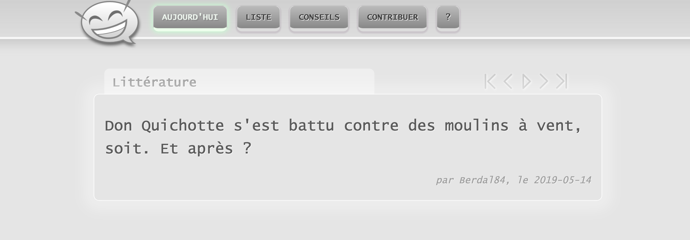
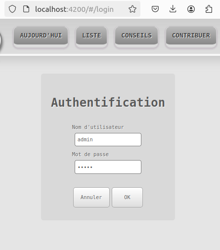
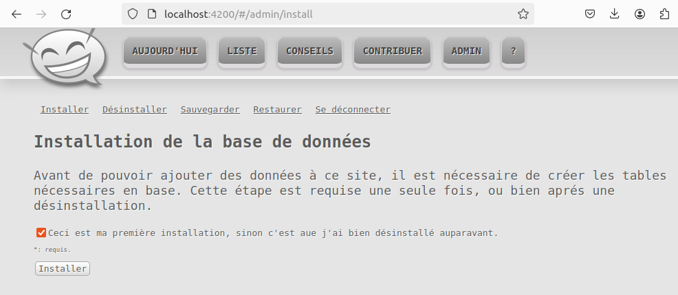
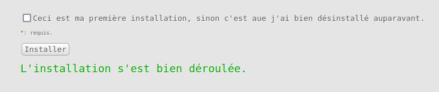

# Jeu de mots

<a href="https://github.com/berdal84/jeudemots-ng/actions?query=workflow Node.js CI" title="ng build">

</a>

## Introduction

_Jeu De Mots_ is a web application to host jokes developed with Angular and PHP.

Try it: [https://jeudemots.42borgata.com](https://jeudemots.42borgata.com)

<div align="center">
  
  <p>Angular Frontend | Slideshow capture<p/>
</div>

## Quick start

### Prerequisites

_Prerequisites: docker is **required**._

### Launch

Run the following command to build and launch the app:

```
docker compose up -d
```

Browse `https://localhost:4200/`

### Post-launch (do once)

Browse `https://localhost:4200/#/login` and login with the following credentials:
- user: `root`
- pass: `devonly`

<div align="center">
  
</div>

Once logged, install the app by following the instructions of the `install` section.

<div align="center">
  
  
</div>

## Project files

Source code is split in two main folders:

- `api`: backend PHP sources and config files.
- `client/ng`: main Angular frontend sources

WIP:

- `client/react-js`: alternative React frontend sources (deployed
  at [https://jeudemots.42borgata.com/react](https://jeudemots.42borgata.com/react))
- `client/vue`: alternative Vue frontend sources (deployed
  at [https://jeudemots.42borgata.com/vue](https://jeudemots.42borgata.com/vue))
- `client/shared`: shared code and resources.

## History

This project started in 2015 during my training at Montpellier Institute of Technology (France), it was developed using
AngularJS 1.7.x and has been translated for Angular 2+ in 2019. The old AngularJS repository is still
available [here](https://www.github.com/berdal84/jeudemots)).

Later in 2022, I decided to implement a backend in PHP8 to store jokes as a MySQL relational database instead of a JSON
file. Additionally, the admin can install/uninstall and restore/backup the table content. After that, I also started to
implement alternative frontends using React and Vue, those are still WIP.
